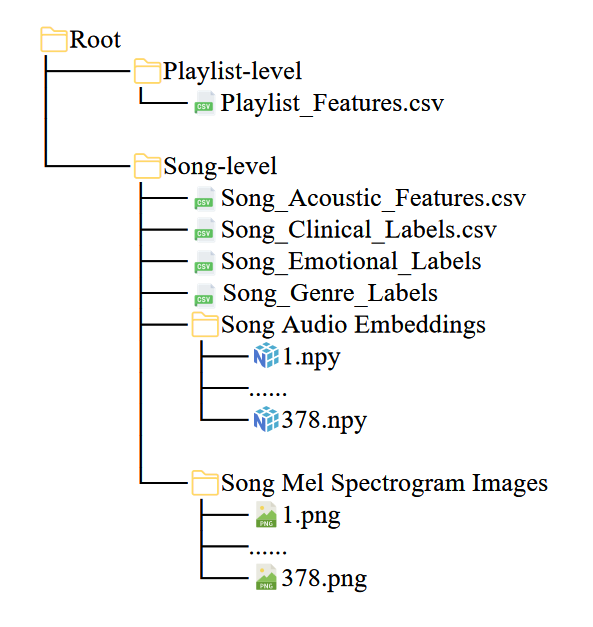

# MCUD: Music Clinical Usage Dataset

## Overview

Music therapy, as a non-pharmaceutical intervention in evidence-based medicine, requires systematic knowledge of clinically effective musical content. However, existing datasets are rarely purpose-built for clinical music therapy and often lack fine-grained clinical annotations, limiting personalized music therapy guidance. We introduce MCUD, a clinically grounded dataset curated from randomized controlled trials indexed in PubMed (2002–2024), comprising 42 playlists and 378 songs spanning diverse clinical contexts, including neurodegenerative disease, affective and anxiety disorders, cognitive impairment, and cardiovascular conditions, with multi‑level annotations at both playlist (treatment goal, disease information, medical procedure, intervention modality) and song levels (genre, emotion, lyrics), plus three audio representations (traditional acoustic features, deep audio embeddings, and mel‑spectrogram images). We validate MCUD through baseline machine learning experiments on three tasks: clinical usage prediction, emotion recognition, and genre classification, achieving best macro F1 scores of 0.4238, 0.2482, and 0.5077, respectively. Correlation analyses further link rhythmic, spectral, and tonal features to clinical usage, emotion, and genre. MCUD provides a high-quality, evidence-based clinical dataset that will be iteratively updated, enabling the development of intelligent systems for personalized music therapy.

### Key Features:
- **Acoustic Fingerprint Data**: Includes audio features like tempo, pitch, and energy extracted from each track.
- **Emotion and Genre Tags**: Provides emotion tags (e.g., happy, sad, relaxed) and genre labels (e.g., rock, classical, jazz) for each song.
- **Spectrograms**: Includes spectrogram images representing the frequency content of the music over time.
- **Pre-computed Embeddings**: Contains music embeddings for song similarity analysis or machine learning tasks.
- **Playlist Information**: Organizes songs into playlists to support specific therapeutic goals.

## Dataset Contents

The dataset is organized as follows:



### File Descriptions

- **Embeddings**: Directory containing pre-computed embeddings for each song. These embeddings represent the acoustic characteristics of the songs and can be used for tasks such as clustering or similarity analysis.
  
- **Spectrogram**: Directory containing the spectrogram images of each song. These images provide a visual representation of the frequency content over time and are useful for audio analysis tasks.

- **Playlist.xlsx**: Excel file containing the playlist information, including the tracklist and the intended therapeutic purpose for the sequence of songs.

- **Songs.xlsx**: Excel file with metadata for each song, including details like the artist, album, and release year.

- **Songs_EmotionTags.xlsx**: Excel file containing emotion tags for each song. Each song is assigned one or more emotional labels such as "happy", "relaxed", "sad", and "energetic".

- **Songs_EmotionTagsProbability.xlsx**: This file contains the probability scores for each emotion tag associated with each song. This allows for a more granular understanding of the emotional qualities of the songs.

- **Songs_Features.xlsx**: Excel file containing extracted audio features for each song, such as tempo, pitch, rhythm, energy, and spectral features.

- **Songs_GenreTags.xlsx**: Excel file containing genre tags for each song (e.g., classical, rock, jazz), which can be useful for categorizing songs based on musical style.

## How to Use

### 1. Download the Dataset
To access the dataset, simply visit the [GitHub repository](https://github.com/your-repo-link) and download the files directly.

### 2. Data Structure
The dataset is organized in folders and Excel files. See the **Dataset Contents** section above for a detailed description of the structure.

```python
import pandas as pd

# Example: Convert Songs.xlsx to CSV
df = pd.read_excel('Songs.xlsx')
df.to_csv('Songs.csv', index=False)
```

### 4. Licensing

The **HMCUD** dataset is released under the [Creative Commons Attribution 4.0 International License (CC BY 4.0)](https://creativecommons.org/licenses/by/4.0/). You are free to use, modify, and share the dataset, as long as you give appropriate credit to the authors.

### 5. Acknowledgments

Please cite this dataset if you use it in your research or applications:

## Ethical Considerations

The **MCUAD** dataset has been created with privacy and ethical considerations in mind. All music tracks used in this dataset are either publicly available or licensed appropriately. Where applicable, all participant feedback data has been anonymized to comply with privacy regulations (e.g., GDPR).

### Important Notes:

* **Music Licensing**: Please ensure that you have the appropriate licenses to use the audio tracks, especially for commercial purposes.
* **Clinical Use**: Always consult a licensed professional when applying the dataset for clinical or therapeutic purposes.

## License

This dataset is released under the [Creative Commons Attribution 4.0 International License (CC BY 4.0)](https://creativecommons.org/licenses/by/4.0/). See the [LICENSE](LICENSE) file for more details.

## Contributions

We welcome contributions to the dataset. If you'd like to improve it or suggest new features, feel free to open an issue or submit a pull request. Please follow the guidelines in our [CONTRIBUTING.md](CONTRIBUTING.md) file for contributing to this project.

